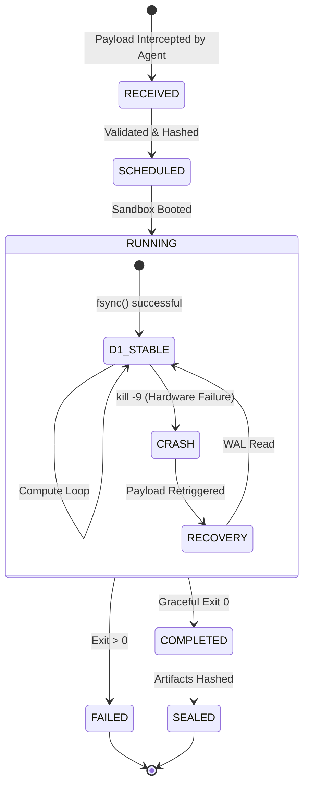
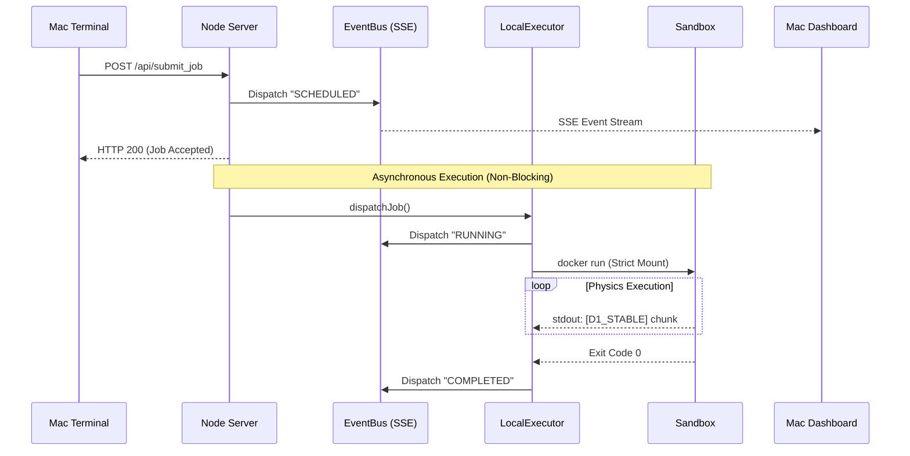

# HackBrain Studio

**Scientific Observability & Distributed Execution Ledger**

HackBrain Studio is a distributed execution architecture and observability platform built for orchestrating complex scientific pipelines, machine learning workloads, and physical OS interactions (like WAL crash-recovery) across a unified network mesh.

---

## 🎯 Core Objectives

### HackBrain v1: The Theoretical Foundation
**Objective:** To build a mathematically deterministic execution ledger. The goal was to prove we could intercept raw OS-level commands, hash inputs deterministically, and enforce a strict Write-Ahead Log (WAL) to guarantee zero-data-loss execution and perfect reproducibility, even during power failures.

### HackBrain v2: The Observability Mesh
**Objective:** To build a fully distributed, physics-level observability instrument. The goal was to take the V1 theoretical core and deploy it across an encrypted Tailscale network, allowing a centralized Mac Observatory (React/Vite) to securely trigger, monitor, and visually trace kernel-level execution states on a remote Ubuntu bare-metal server in real-time.

---

## 🏗️ Repository Structure

This repository contains the full evolution of the HackBrain architecture:

### 1. `hackbrain-v1-core/`
The original foundational framework. Contains the core theoretical Node.js logic for building isolated sandboxes, parsing OS configurations, and modeling execution graphs.

### 2. `agent/` (HackBrain v2 Control Agent)
The physical daemon that runs on the bare-metal execution server (e.g., Ubuntu).
- Written in pure Node.js.
- Binds to network interfaces and intercepts payloads over HTTP/SSE.
- Strips the payload and forces execution into strictly isolated Docker sandboxes (`python:3.9-slim`).
- Extracts kernel-level telemetry and streams state updates in real-time.

### 3. `frontend/` (HackBrain Studio v2 Dashboard)
The primary observability instrument. A React/Vite dashboard that visually reconstructs execution states.
- Connects securely over the network (e.g., Tailscale mesh) to the Control Agent.
- Listens to deterministic Server-Sent Events (SSE).
- Features a **TraceViewer** to visualize chronological state survival (SCHEDULED $\rightarrow$ RUNNING $\rightarrow$ COMPLETED).

### 4. `docs/architecture/`
The ultimate source of truth for the system's design.
- **HackBrain_System_Overview.md**: High-level design document.
- **phase_diagram.md**: Mathematical formalization of execution state spaces.
- **hackbrain_execution_checklist.md**: Strict decision-boundary rules for maintaining true OS-level observability without abstract simulation.
- **walkthrough.md**: Log of our physical `kill -9` Chaos Engineering experiment that proved monotonic WAL crash recovery.

---

## 🚀 Execution Topology

The system operates across a dual-machine distributed bridge (e.g., Mac $\leftrightarrow$ Ubuntu over Tailscale):

```mermaid
graph TD
    subgraph Local Environment [Mac: Command & Observability]
        Dashboard[HackBrain Studio v2<br/>React / Vite]
        Terminal[CLI Trigger<br/>curl POST]
    end

    subgraph Distributed Network [Encrypted Tailscale Mesh]
        SSE[Server-Sent Events<br/>State Stream]
        HTTP[HTTP POST<br/>Payload Delivery]
    end

    subgraph Execution Environment [Ubuntu: Bare Metal Server]
        Agent[Node Control Agent<br/>Port 4005]
        EventBus[(In-Memory Event Bus<br/>& Local Log File)]
        
        subgraph Sandbox Boundary [Strict Execution Isolation]
            Docker[Docker Container<br/>python:3.9-slim]
            WAL[(Bare Metal Disk<br/>Write-Ahead Log)]
        end
    end

    %% Connections
    Terminal -- 1. Submit Job Manifest --> HTTP
    HTTP --> Agent
    
    Dashboard <-- 4. Consume Trace Events -- SSE
    SSE <-- Agent

    Agent -- 2. Spin up secured container --> Docker
    Docker -- 3. fsync() state --> WAL
    Docker -. stdout / stderr .-> Agent
    
    Agent --> EventBus
    EventBus --> Agent
```

1. The **Control Agent** (`server.js`) runs indefinitely on the execution server, listening on port `4005`.
2. The **Observatory Dashboard** runs locally on the command node (`npm run dev`).
3. Execution payloads are defined as JSON manifests and fired across the network using standard Unix tools (`curl`).

```bash
# Example Payload Dispatch
curl -X POST http://<execution-node-ip>:4005/api/submit_job \
  -H "Content-Type: application/json" \
  -d '{
    "job_id": "job_9999_chaos_test",
    "image_hash": "python:3.9-slim",
    "command": ["python", "wal_physics.py"],
    "mount_spec": "/path/to/payload:/job/workdir"
  }'
```

---

## 🛡️ Chaos Engineering & Deterministic State

This architecture has been physically stressed using Write-Ahead Log (WAL) mechanics. By forcing aggressive `kill -9` container terminations during synchronous disk I/O, we successfully verified that this distributed network accurately traces kernel-level terminations and effortlessly supports monotonic state recovery.

### Trace Lifecycle State Machine



### Node.js Asynchronous Pipeline



*No abstractions. No simulations. Just bare-metal telemetry.*
