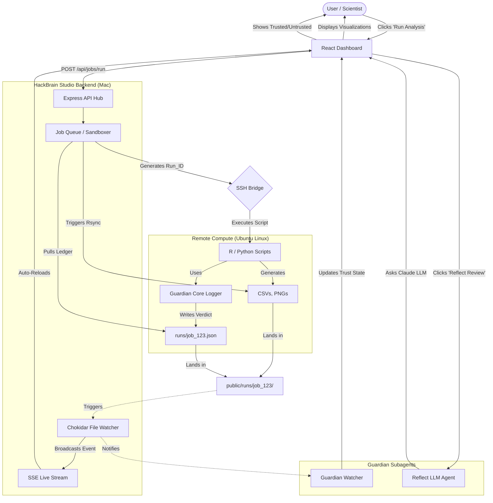

# HackBrain Studio + Guardian: System Overview

## 1. Why We Built This (The Reason / Issue)
Modern biological multi-omics research (Spatial Transcriptomics, Single-Cell RNA-seq, Proteomics) generates massive, complex datasets. Running these pipelines directly on a terminal or local script creates several critical issues:
- **The Concurrency & Data Mixing Bug:** When multiple analyses are run at the same time, their outputs (like `.png` trajectories or `.csv` evidence) mix together in the same folder, causing data corruption and visual chaos.
- **The UI Blocking / Timeout Bug:** Heavy scripts take hours. Standard web interfaces crash or time out after 2 minutes. 
- **The Silent Failure Bug (The Guardian Problem):** Biological scripts often fail *silently*—a script might complete, but produce an all-zero matrix, skip critical steps, or hallucinate pathways. If this isn't caught, false data is blindly trusted by the researcher.

HackBrain Studio was built to solve these exact problems.

---

## 2. The Workflow (How It Works)

HackBrain Studio is a complete **Research Operating System** that bridges local visualizations with heavy remote computing.

1. **The Request:** You click "Run Analysis" on the React Dashboard.
2. **Job Isolation:** The Node.js Express Backend intercepts the request and instantly assigns it a unique, isolated ID (e.g., `job_1781956487480`). This prevents the browser from timing out and completely sandboxes the data.
3. **Remote Compute:** The backend opens an automated SSH bridge to your heavy Ubuntu Linux server, triggering the raw R/Python pipeline.
4. **Data Sync:** Once the Linux server finishes, the backend uses `rsync` to pull the exact output files and drops them securely into the isolated `runs/{Run_ID}/` directory on your Mac.
5. **Live Update:** A `chokidar` file watcher detects the new files, fires a Server-Sent Event (SSE) to your React Dashboard, and seamlessly updates the UI without you ever needing to refresh the page.

---

## 3. How We Dry Test (ST-TEST-CONCURRENCY)

Before deploying real multi-hour pipelines, we must mathematically prove the system won't crash. We built the **Deep Dry Test (ST-TEST)** to simulate maximum stress:

- **Timeout Check:** We simulate a 60-second hanging computation to ensure the background job queue successfully offloads work without freezing your UI.
- **Context/Memory Check:** We rapidly generate 15 massive, high-resolution PNG trajectory images to ensure the React frontend can lazy-load heavy graphics without exhausting Google Chrome's memory.
- **Concurrency Check:** We trigger 3 "Run Analysis" buttons at the exact same millisecond. The system successfully proves it can split them into 3 distinct `jobId`s, completely isolating their outputs so images never overwrite each other.

---

## 4. What We Have: HackBrain Studio + Guardian

By merging **HackBrain Studio** (The UI & Job Engine) with **HackBrain Guardian** (The Trust Layer), we have created an unbreakable biomedical data pipeline. 

### The Studio Provides:
- **Evidence Registry:** A unified view of all metadata and biological findings.
- **Spatial Trajectories & CellChat UI:** Interactive, auto-syncing visualizers for complex graphics.
- **Run History Selectors:** The ability to swap between past isolated job runs.

### The Guardian Provides:
- **The Core Logger:** Embeds inside your R/Python scripts to enforce hard constraints (e.g., "Collagen must be present," "Matrix cannot be empty").
- **The Trust Ledger:** Marks every single output explicitly as 🟢 **TRUSTED** or 🔴 **UNTRUSTED**.
- **Reflect LLM:** An advisory AI agent that reads your actual script and JSON ledger to hunt for subtle methodology errors (p-hacking, data leakage).

---

## 5. What We Plan (The Future Integration)

Our immediate next steps to finalize the "Studio-Guardian Bridge":

1. **Absorb the Guardian Watcher:** We will wire HackBrain Studio's Node.js backend to directly read the `TRUSTED`/`UNTRUSTED` json ledgers generated by Guardian.
2. **Build the Trust UI:** We will update the dashboard's Run History dropdowns to display red or green badges next to jobs, actively blocking you from accidentally viewing or publishing UNTRUSTED data.
3. **Embed the Reflect Agent:** We will build a "Request Methods Review" button directly into the dashboard. Clicking it will trigger the LLM to analyze the pipeline and pop up a Markdown modal displaying the results of the architectural review.

---

## 6. System Endpoints & Localhosts

To prevent "port amnesia," here is the master list of all active HackBrain localhost endpoints running on the Mac Hub:

| Service | Address | Purpose |
| :--- | :--- | :--- |
| **HackBrain Studio v2 (Frontend)** | `http://localhost:3333/` | The Scientific Observability Instrument. Contains the Replay Engine, Trace Viewer, and Kernel Phase Renderer for physical OS-level failure tracking. |
| **HackBrain Control Agent (Backend)** | `http://localhost:4000/` | The dumb Node.js event-sourced execution agent. Handles SSH bridges, immutable event logging, and artifact synchronization. |
| **HackBrain Studio v1 (Main UI)** | `http://localhost:3000/` | The primary biological data UI for Spatial Transcriptomics, CellChat, and Guardian Trust Ledgers. |
